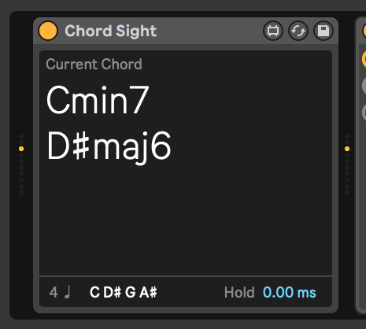

# Chord Sight

A Max for Live MIDI device to monitor chords detected from MIDI input.

# Installation

Download the amxd from the [releases page](https://github.com/danielgamage/Chord-Sight/releases).
